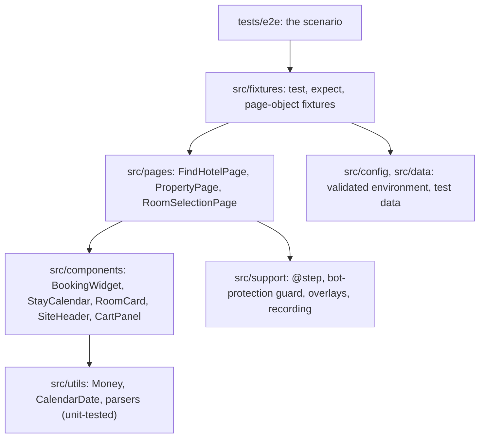

# Architecture

## Layers

- Specs hold steps and assertions only.
- Locators are defined once, in constructors.
- Logic that needs no browser lives in `src/utils` and runs in the `unit` project.
- Overlay handling and recording come from fixtures; third-party blocking is a browser launch option.

## Flow

**Dates.** Day buttons are labelled `<state> <weekday>, <Month> <d>, <yyyy>` and the state prefix changes as
the selection progresses, so days are located by the date suffix. Check-in is the first bookable day from
today + `CHECK_IN_OFFSET_DAYS`, trying up to `AVAILABILITY_SEARCH_DAYS` more; check-out is the first
selectable day at least `NIGHTS` later. The calendar re-renders asynchronously after _Next month_, so paging
waits for the rendered months to change.

**Adding a room.** The first card with a booking button is pinned by name, so a re-render cannot swap it.
Rooms with several bed types need _Select Bed Options_ first; the price is read once the row switches from
"From …" to the chosen bed's price.

**Opening the cart.** After _Add to Cart_ the header shows `Cart(1)` just before the site redirects to an
upsell page, which would discard an open cart panel. The page object waits up to 10 s for that redirect and
carries on if none comes.

## Locators

1. Site hooks: `data-tracking-id="add-to-cart"`, `data-tracking-id="select-bed-options"`,
   `data-cy="rate-card-fees-disclaimer"`, `data-cy="shopping-cart-item__taxes-and-fees"`.
2. Roles and accessible names: the availability form, calendar, cart dialog and cart button.
3. Component classes: `RoomListing-room-results`, `FilteredColumnsList-item`. Never utility classes.

Elements without a hook are reached from the nearest one with a single XPath axis step:

| Element      | Anchor                | Step                                       |
| ------------ | --------------------- | ------------------------------------------ |
| rate row     | booking button        | nearest ancestor containing _Rate Details_ |
| rate name    | _Rate Details_ button | preceding sibling                          |
| rate price   | rate fees disclaimer  | preceding sibling                          |
| selected bed | checked radio         | its label's following sibling              |
| cart item    | item fees disclaimer  | nearest ancestor containing _Remove_       |
| cart price   | item fees disclaimer  | preceding sibling                          |
| cart dates   | property heading      | following sibling                          |

`/find_a_hotel_or_resort/` renders every hotel once per category tab, plus featured links with the same
text, so the property link is looked up inside the visible _North America_ region.

## Prices

`Money` stores integer minor units and the displayed precision (`CAD 1,448.81` is `144881` at precision 2);
currency codes are validated against ISO 4217. Two prices match when the currency is the same and they
differ by less than one unit of the coarser display, which holds whether the rate card rounds, floors or
ceils.

## Resilience

| Risk                         | Handling                                                                 |
| ---------------------------- | ------------------------------------------------------------------------ |
| Cookie banner                | `OptanonAlertBoxClosed` cookie set up front; locator handler as fallback |
| Survey pop-over              | host blocked at DNS; locator handler removes it if it appears            |
| Bot manager                  | headed runs; `BotProtectionError` as soon as a block page loads          |
| Sold-out days, minimum stays | check-in search window; first selectable check-out                       |
| Asynchronous UI              | web-first assertions and waits on specific state, never on time          |
| Geolocated currency          | no currency assumed; the cart and the rate card must agree               |

## Reporting

Report steps mirror a–f, with page-object steps nested under them by `@step()`; `box: true` reports a failure
at the calling line. The stay and the selected room are attached as annotations, with a screenshot of the
cart. Traces, screenshots and videos are kept for failures, and for every run in recording mode.

## Self-test

`tools/offline-site` is a dependency-free replica of the four pages with the same roles, hooks and timing
quirks. `npm run test:mutations` requires the spec to pass on it with and without the post-add redirect, to
fail with `BotProtectionError` on a block page, and to fail on the intended assertion for each of 8 cart
defects. The replica proves the assertions and the flow logic; only the live run proves the locators.

## Extending

- Another hotel: add a `Property` to `src/data/properties.ts`, then a spec or a data-driven loop.
- Another flow: add component methods and a spec; fixtures supply overlays, reporting and recording.
- More browsers: add projects to `playwright.config.ts`. Tests are independent and shard with `--shard`.
